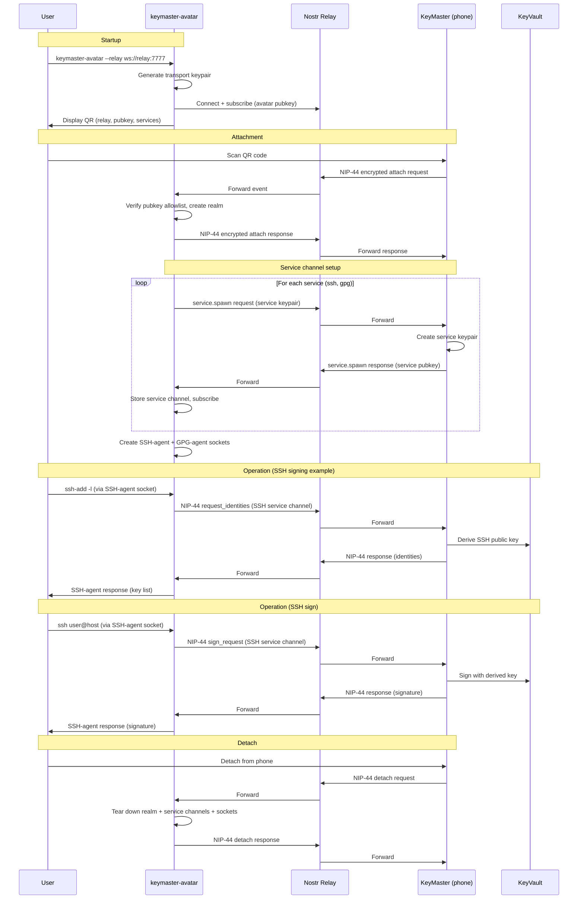

# Phase 1 Interactive Deployment Sequence

This diagram shows the Phase 1 interactive flow. The current prototype
bundles Avatar and its service avatars into one process, so the SSH/GPG
protocol sockets are served directly by `keymaster-avatar`.

