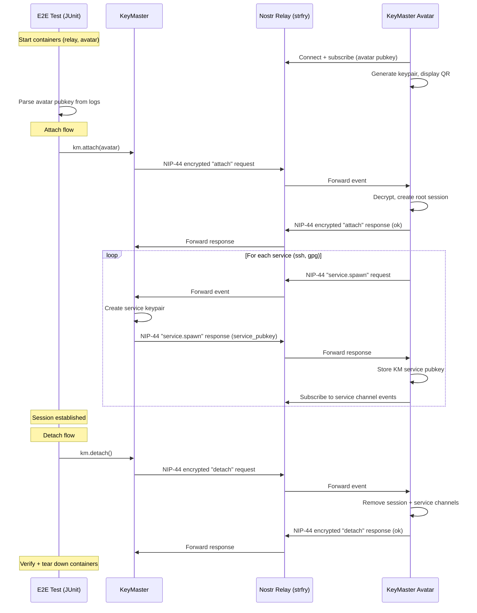

# E2E Test Sequence

```mermaid
sequenceDiagram
    participant Test as E2E Test (JUnit)
    participant KM as KeyMaster
    participant Relay as Nostr Relay (strfry)
    participant Avatar as KeyMaster Avatar

    Note over Test: Start containers (relay, avatar)
    Avatar->>Relay: Connect + subscribe (avatar pubkey)
    Avatar->>Avatar: Generate keypair, display QR
    Test->>Test: Parse avatar pubkey from logs

    Note over Test: Attach flow
    Test->>KM: km.attach(avatar)
    KM->>Relay: NIP-44 encrypted "attach" request
    Relay->>Avatar: Forward event
    Avatar->>Avatar: Decrypt, create root session
    Avatar->>Relay: NIP-44 encrypted "attach" response (ok)
    Relay->>KM: Forward response

    loop For each service (ssh, gpg)
        Avatar->>Relay: NIP-44 "service.spawn" request
        Relay->>KM: Forward event
        KM->>KM: Create service keypair
        KM->>Relay: NIP-44 "service.spawn" response (service_pubkey)
        Relay->>Avatar: Forward response
        Avatar->>Avatar: Store KM service pubkey
        Avatar->>Relay: Subscribe to service channel events
    end

    Note over Test: Session established

    Note over Test: Detach flow
    Test->>KM: km.detach()
    KM->>Relay: NIP-44 encrypted "detach" request
    Relay->>Avatar: Forward event
    Avatar->>Avatar: Remove session + service channels
    Avatar->>Relay: NIP-44 encrypted "detach" response (ok)
    Relay->>KM: Forward response

    Note over Test: Verify + tear down containers
```
